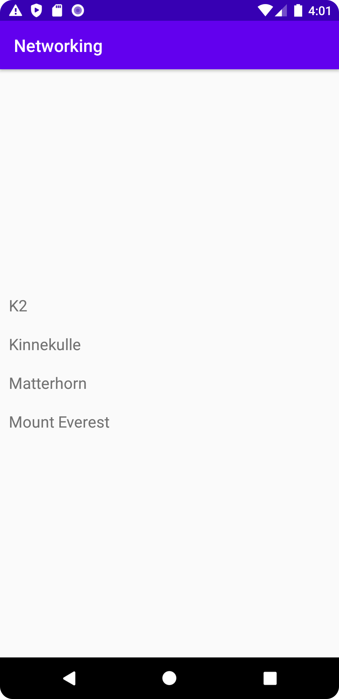

# Rapport

Skapat recyclerview (klass och XML) + en recyclerview adapter 
(som kopplar datan till RecyclerView:n) samt en Mountain klass
för att kunna överföra JSON arrayen med hjälp av Gson som ska nå en API
med några berg 
(endast namn på berg visas i detta program pga Mountain klassen, men kan ändras)
så att det visas i RecyclerView:n


```
Main Activity Kod:
OBS! ENDAST DEN RELEVANTA KODEN VISAS. 
EJ KOD EMELLAN
    
    private final String JSON_URL = "https://mobprog.webug.se/json-api?login=brom";

    ArrayList<Mountain> Mountains= new ArrayList<>();
    Gson gson = new Gson();

    String json = gson.toJson(Mountains);

    Type type = new TypeToken<ArrayList<Mountain>>() {}.getType();
    ArrayList<Mountain> Mountains = gson.fromJson(json, type);

    RecyclerView RecyclerView = findViewById(R.id.RecyclerView);

    RecyclerViewAdapter adapter = new RecyclerViewAdapter (this, Mountains);
    RecyclerView.setAdapter(adapter);
    RecyclerView.setLayoutManager(new LinearLayoutManager(this));
    adapter.notifyDataSetChanged();
```

```
RecyclerViewAdapter Kod:
OBS! endast program koden visas ej XML koden för RecyclerView
Det blir svårt att minimera koden för RecyclerViewAdapter så hela klassen står med

public class RecyclerViewAdapter extends RecyclerView.Adapter<RecyclerViewAdapter.MyViewHolder> {
    Context context;
    ArrayList <Mountain> Mountains;
    public RecyclerViewAdapter(Context context, ArrayList<Mountain> Mountains){
        this.context =context;
        this.Mountains=Mountains;
    }
    @NonNull
    @Override
    public RecyclerViewAdapter.MyViewHolder onCreateViewHolder(@NonNull ViewGroup parent, int viewType) {
        LayoutInflater inflater = LayoutInflater.from(context);
        View view =inflater.inflate(R.layout.recycler_layout, parent, false);

        return new RecyclerViewAdapter.MyViewHolder (view);
    }

    @Override
    public void onBindViewHolder(@NonNull RecyclerViewAdapter.MyViewHolder holder, int position) {
        holder.textview.setText(Mountains.get(position).getName());
    }

    @Override
    public int getItemCount() {
        return Mountains.size();
    }

    public static class MyViewHolder extends RecyclerView.ViewHolder{
        TextView textview;
        public MyViewHolder(@NonNull View itemView) {
            super(itemView);

            textview = itemView.findViewById(R.id.title);
        }
    }
}
```


Bilder:

RecyclerView med skickad JSON data (med hjälp av Gson och Adapter)

